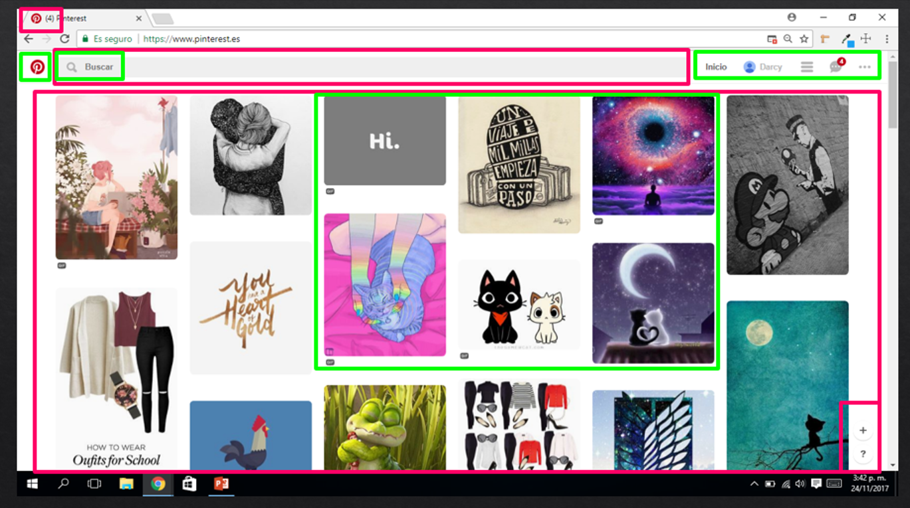
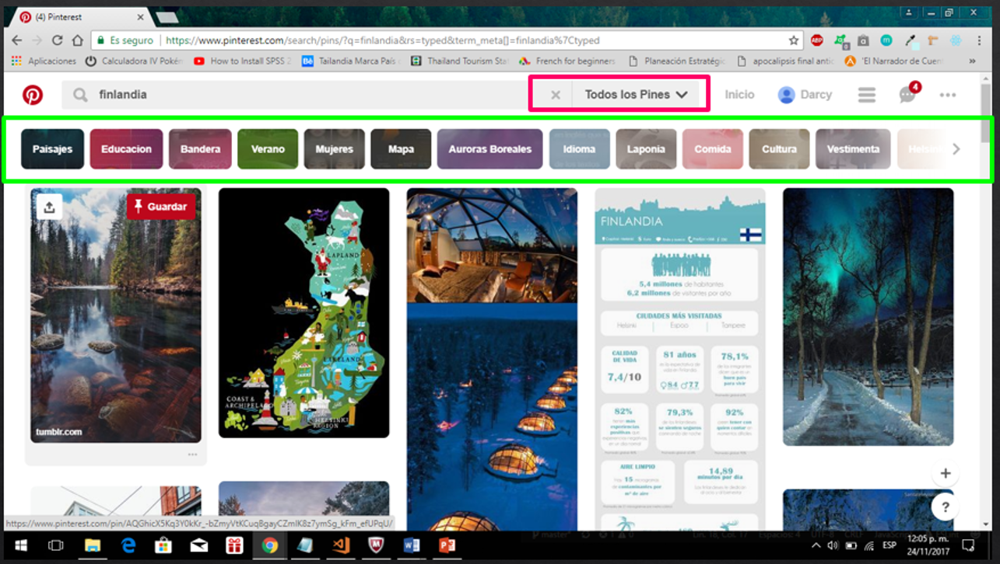

# Proyecto 1: Explicar que partes conforman un UX y un UI

## Descripción del Proyecto

De una página de mi elección, dividir que partes hace un ux-designer y cuales hace un ui-designer en la creación de una página web.

## La página que elegí fue: Pinterest

Entonces, según en la imagen los cuadros con **bordes verdes** en mi opinión es trabajo de un UI-designer. Y, los cuadros con **bordes fucsia** considero es trabajo de un UX-designer.

Y, cuando se escribe en el buscador de la página.

### Explicación de la parte que conforma un UI-designer

* Diseño de íconos.
* Orden en la posición de las imágenes.
* Bordes redondeados en las imágenes.
* Los colores de la página e íconos.
* Diseño de los íconos de la navegación local.
* Barra de íconos en el buscador.

### Explicación de la parte que conforma un UX-designer

* Organización de las presentación de la página.
* Íconos de ayuda al usuario en la navegación de la página (en la parte inferior).
* El número de notificaciones en la pestaña de la página.
* Volver al inicio dentro de la página al hacer click en el ícono de **X**.
* Acceder al grupo de imagenes guardadas en la cuenta que coincida con el nombre puesto en el buscador.
